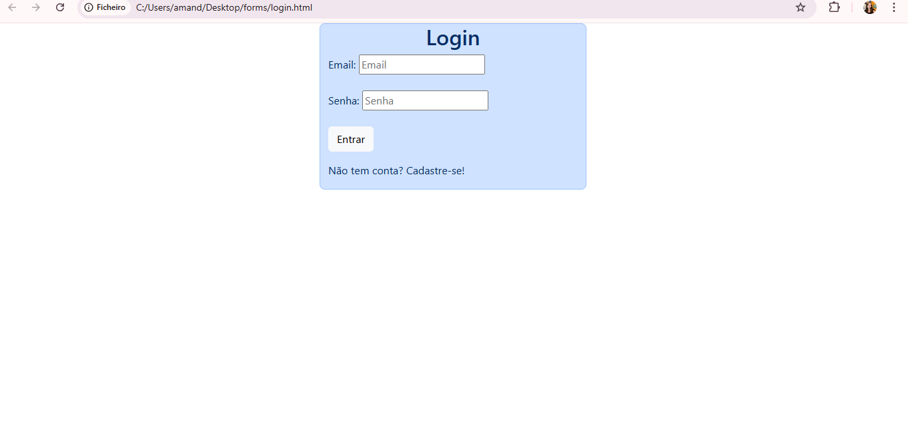

# Projeto de Login com Bootstrap

## Nome do aluno
Amanda Luise Gonçalves da Maia

## Descrição da atividade
Este projeto consiste no desenvolvimento de uma tela de login utilizando HTML, CSS e Bootstrap.
A interface possui campos de email e senha, botão de login e layout responsivo.

## Print da tela desenvolvida
